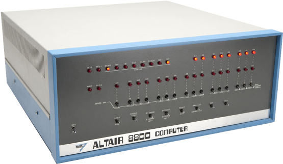

# altairsim AppImage

Emulation of an Altair 8800 system with 8080 or Z80 CPU, 64KB RAM, Cromemco Dazzler graphics, Tarbell SD disk controller with four 8" SD disk drives, front panel, 88SIO-2 connected to the host terminal, line printer connected to host file. Part of [z80pack](https://www.autometer.de/unix4fun/z80pack/), which is a Zilog Z80 and Intel 8080 cross development package for UNIX and Windows systems.
 

## References

* https://www.autometer.de/unix4fun/z80pack/
* https://github.com/udo-munk/z80pack
